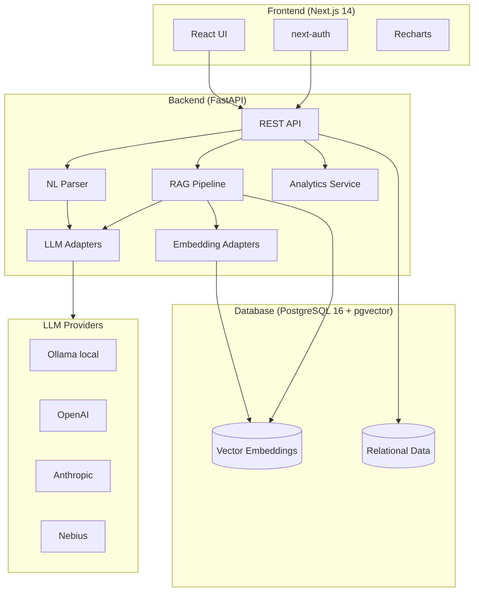

# JobHound

> AI-powered job application tracker with natural language input, RAG chat, and rich analytics.

JobHound lets you track job applications by pasting in free-form text ("Applied to Acme Corp for Senior Engineer, remote, €80-100k, found on LinkedIn") and have the AI parse it into structured data. Chat with your application history using RAG, and visualize your job search with a comprehensive analytics dashboard.

## Architecture



## Tech Stack

| Layer | Technology | Reasoning |
|-------|------------|-----------|
| Frontend | Next.js 14 (App Router) | Server components, streaming, excellent DX |
| UI | shadcn/ui + Tailwind CSS | Accessible, unstyled primitives with rapid customization |
| Charts | Recharts | React-native, composable, good defaults |
| Auth | next-auth | Handles OAuth complexity, great Next.js integration |
| Backend | FastAPI | Async-first, auto-docs, Python type safety |
| ORM | SQLAlchemy 2.0 (async) | Mature, powerful, async support |
| Migrations | Alembic | Industry standard for SQLAlchemy |
| Database | PostgreSQL 16 + pgvector | Single DB for relational + vector, production-grade |
| LLM | Pluggable (Ollama/OpenAI/Anthropic/Nebius) | No vendor lock-in, local-first |

## Prerequisites

- [Docker](https://docs.docker.com/get-docker/) & Docker Compose
- [Node.js 20+](https://nodejs.org/) (for local frontend dev)
- [Python 3.12+](https://www.python.org/) (for local backend dev)
- [Ollama](https://ollama.ai/) (optional, for local LLM)

## Quick Start

```bash
# 1. Clone and configure
git clone https://github.com/sumdher/jobhound
cd jobhound

# 2. Set up environment files
cp backend/.env.example backend/.env
cp frontend/.env.example frontend/.env.local

# Edit both .env files with your values
# Minimum required: GOOGLE_CLIENT_ID, GOOGLE_CLIENT_SECRET, JWT_SECRET, NEXTAUTH_SECRET

# 3. Start everything
docker compose up

# Frontend: http://localhost:3000
# Backend API: http://localhost:8000
# API Docs: http://localhost:8000/docs
```

## Production Deployment with Docker Compose

Use [`docker-compose.prod.yml`](docker-compose.prod.yml) for a production-oriented stack. It keeps the existing development setup in [`docker-compose.yml`](docker-compose.yml) untouched while switching frontend and backend builds to their `production` Docker targets, removing source bind mounts, and wiring in a Cloudflare Tunnel sidecar that authenticates with a tunnel token from the root env file.

```bash
# 1. Create runtime env files
cp backend/.env.example backend/.env
cp frontend/.env.example frontend/.env

# 2. Update production values
# - set strong secrets
# - set APP_URL to your public HTTPS URL
# - set NEXTAUTH_URL to your public HTTPS URL
# - set provider credentials/API keys

# 3. Configure the Cloudflare Tunnel
cp deploy/cloudflared/config.example.yml deploy/cloudflared/config.yml
# edit deploy/cloudflared/config.yml
# add CLOUDFLARE_TUNNEL_TOKEN=<your-tunnel-token> to the root .env
#
# If you keep the real config file outside the repo, set this in the root `.env`
# instead of copying it into `deploy/cloudflared/`:
# CLOUDFLARED_CONFIG_PATH=/absolute/path/to/config.yml

# 4. Start the production stack
docker compose -f docker-compose.prod.yml up -d --build
```

Production characteristics:

- frontend and backend use the existing Docker `production` targets
- no source-code bind mounts or dev-only Next.js cache mounts
- PostgreSQL data stays in a named volume
- backend runs database migrations before starting
- frontend, backend, and database all have container healthchecks
- Cloudflare Tunnel uses a pinned image version, local config file, and token-based authentication from the root `.env`

For production, the tunnel now requires:

- a root [`.env.example`](.env.example) value for `CLOUDFLARE_TUNNEL_TOKEN`
- a real local [`deploy/cloudflared/config.yml`](deploy/cloudflared/config.yml) file, unless you point [`docker-compose.prod.yml`](docker-compose.prod.yml) at another config path with `CLOUDFLARED_CONFIG_PATH`

Unlike the previous setup, production no longer requires a live `credentials.json` bind mount inside the repository.

By default [`docker-compose.prod.yml`](docker-compose.prod.yml) looks for the config file at [`deploy/cloudflared/config.yml`](deploy/cloudflared/config.yml). If your local secrets workflow stores that file somewhere else, point Compose at it with `CLOUDFLARED_CONFIG_PATH` in the root `.env`.

The production tunnel container reads its authentication token from `CLOUDFLARE_TUNNEL_TOKEN` in the root `.env` and starts [`cloudflared`](docker-compose.prod.yml:73) with a token-based `tunnel run` command. Keep that token out of git and out of the repository tree.

For production, set at least these values before startup:

- root [`.env.example`](.env.example): `CLOUDFLARE_TUNNEL_TOKEN` and optional `CLOUDFLARED_CONFIG_PATH`
- [`backend/.env.example`](backend/.env.example): `DATABASE_URL`, `JWT_SECRET`, `APP_URL`, OAuth credentials, any LLM/embedder provider secrets
- [`frontend/.env.example`](frontend/.env.example): `NEXTAUTH_SECRET`, `NEXTAUTH_URL`, OAuth credentials

## Environment Variables

### Backend (`backend/.env`)

| Variable | Required | Default | Description |
|----------|----------|---------|-------------|
| `DATABASE_URL` | Yes | `postgresql+asyncpg://...` | PostgreSQL connection string |
| `GOOGLE_CLIENT_ID` | Yes | — | Google OAuth client ID |
| `GOOGLE_CLIENT_SECRET` | Yes | — | Google OAuth client secret |
| `JWT_SECRET` | Yes | `change-me` | Secret for signing JWTs |
| `LLM_PROVIDER` | No | `ollama` | LLM provider: `ollama`, `openai`, `anthropic`, `nebius` |
| `OLLAMA_URL` | No | `http://host.docker.internal:11434` | Ollama base URL |
| `OLLAMA_MODEL` | No | `gemma4:e4b` | Ollama model name |
| `OPENAI_API_KEY` | If using OpenAI | — | OpenAI API key |
| `ANTHROPIC_API_KEY` | If using Anthropic | — | Anthropic API key |
| `NEBIUS_API_KEY` | If using Nebius | — | Nebius API key |
| `EMBEDDING_PROVIDER` | No | `ollama` | Embedding provider: `ollama`, `openai` |
| `EMBEDDING_MODEL` | No | `nomic-embed-text` | Embedding model name |
| `EMBEDDING_DIMENSION` | No | `1536` | Embedding vector dimensions |

### Frontend (`frontend/.env.local`)

| Variable | Required | Default | Description |
|----------|----------|---------|-------------|
| `NEXT_PUBLIC_API_URL` | Yes | `http://localhost:8000` | Backend API URL |
| `NEXTAUTH_URL` | Yes | `http://localhost:3000` | Frontend base URL |
| `NEXTAUTH_SECRET` | Yes | — | NextAuth secret |
| `GOOGLE_CLIENT_ID` | Yes | — | Google OAuth client ID |
| `GOOGLE_CLIENT_SECRET` | Yes | — | Google OAuth client secret |

## Switching LLM Providers

Switching providers requires only 2 environment variable changes:

```bash
# Use OpenAI
LLM_PROVIDER=openai
OPENAI_MODEL=gpt-4o-mini
OPENAI_API_KEY=sk-...

# Use Anthropic
LLM_PROVIDER=anthropic
ANTHROPIC_MODEL=claude-sonnet-4-20250514
ANTHROPIC_API_KEY=sk-ant-...

# Use local Ollama
LLM_PROVIDER=ollama
OLLAMA_MODEL=gemma4:e4b
```

## API Documentation

Interactive API docs available at `http://localhost:8000/docs` (Swagger UI) and `http://localhost:8000/redoc` (ReDoc).

## Development

```bash
# Backend only
cd backend
pip install -e ".[dev]"
uvicorn app.main:app --reload

# Frontend only
cd frontend
npm install
npm run dev

# Run backend tests
cd backend
pytest

# Run linting
cd backend && ruff check . && mypy .
cd frontend && npm run lint
```

## Roadmap

- [ ] Cloud deployment (AWS ECS / Railway)
- [ ] Email notifications for application status changes
- [ ] Calendar integration (interview scheduling)
- [ ] Browser extension for one-click capture from LinkedIn/Indeed
- [ ] Export to CSV/Excel
- [ ] Resume/CV storage and matching
- [ ] Recruiter contact tracking
- [ ] Salary benchmarking via market data APIs
