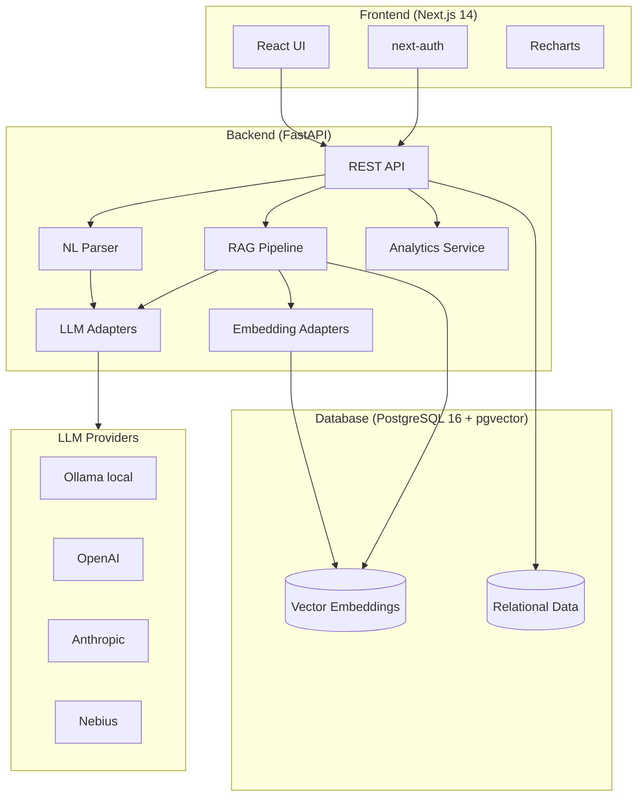

# JobHound

> AI-powered job application tracker with natural language input, RAG chat, and rich analytics.

JobHound lets you track job applications by pasting in free-form text ("Applied to Acme Corp for Senior Engineer, remote, €80-100k, found on LinkedIn") and have the AI parse it into structured data. Chat with your application history using RAG, and visualize your job search with a comprehensive analytics dashboard.

## Architecture



## Tech Stack

| Layer | Technology | Reasoning |
|-------|------------|-----------|
| Frontend | Next.js 14 (App Router) | Server components, streaming, excellent DX |
| UI | shadcn/ui + Tailwind CSS | Accessible, unstyled primitives with rapid customization |
| Charts | Recharts | React-native, composable, good defaults |
| Auth | next-auth | Handles OAuth complexity, great Next.js integration |
| Backend | FastAPI | Async-first, auto-docs, Python type safety |
| ORM | SQLAlchemy 2.0 (async) | Mature, powerful, async support |
| Migrations | Alembic | Industry standard for SQLAlchemy |
| Database | PostgreSQL 16 + pgvector | Single DB for relational + vector, production-grade |
| LLM | Pluggable (Ollama/OpenAI/Anthropic/Nebius) | No vendor lock-in, local-first |

## Prerequisites

- [Docker](https://docs.docker.com/get-docker/) & Docker Compose
- [Node.js 20+](https://nodejs.org/) (for local frontend dev)
- [Python 3.12+](https://www.python.org/) (for local backend dev)
- [Ollama](https://ollama.ai/) (optional, for local LLM)

## Quick Start

```bash
# 1. Clone and configure
git clone https://github.com/<your-username>/jobhound
cd jobhound

# 2. Set up environment files
cp backend/.env.example backend/.env
cp frontend/.env.example frontend/.env.local

# Edit both .env files with your values
# Minimum required: GOOGLE_CLIENT_ID, GOOGLE_CLIENT_SECRET, JWT_SECRET, NEXTAUTH_SECRET

# 3. Start everything
docker compose up

# Frontend: http://localhost:3000
# Backend API: http://localhost:8000
# API Docs: http://localhost:8000/docs  (only when DEBUG=true)
```

## Production Deployment with Docker Compose

Use [`docker-compose.prod.yml`](docker-compose.prod.yml) for a production-oriented stack. It keeps the existing development setup in [`docker-compose.yml`](docker-compose.yml) untouched while switching frontend and backend builds to their `production` Docker targets, removing source bind mounts, and wiring in a Cloudflare Tunnel sidecar that authenticates with a tunnel token from the root env file.

```bash
# 1. Create runtime env files
cp backend/.env.example backend/.env
cp frontend/.env.example frontend/.env

# 2. Update production values
# - set strong secrets
# - set APP_URL to your public HTTPS URL
# - set NEXTAUTH_URL to your public HTTPS URL
# - set provider credentials/API keys

# 3. Configure the Cloudflare Tunnel
cp deploy/cloudflared/config.example.yml deploy/cloudflared/config.yml
# edit deploy/cloudflared/config.yml
# add CLOUDFLARE_TUNNEL_TOKEN=<your-tunnel-token> to the root .env
#
# If you keep the real config file outside the repo, set this in the root `.env`
# instead of copying it into `deploy/cloudflared/`:
# CLOUDFLARED_CONFIG_PATH=/absolute/path/to/config.yml

# 4. Start the production stack
docker compose -f docker-compose.prod.yml up -d --build
```

 Production characteristics:

- frontend and backend use the existing Docker `production` targets
- no source-code bind mounts or dev-only Next.js cache mounts
- PostgreSQL data stays in a named volume
- backend runs database migrations before starting
- frontend, backend, and database all have container healthchecks
- Cloudflare Tunnel uses a pinned image version, local config file, and token-based authentication from the root `.env`

## Daily database backups

The production database runs in the [`db` service](docker-compose.prod.yml:5) in [`docker-compose.prod.yml`](docker-compose.prod.yml). This repository now includes a host-side backup script at [`deploy/backup/jobhound-db-backup.sh`](deploy/backup/jobhound-db-backup.sh) plus example systemd unit files at [`deploy/backup/jobhound-db-backup.service`](deploy/backup/jobhound-db-backup.service) and [`deploy/backup/jobhound-db-backup.timer`](deploy/backup/jobhound-db-backup.timer).

Recommended behavior:

- the host runs the script once per day via systemd timer
- the script connects to the running PostgreSQL container with [`pg_dump`](deploy/backup/jobhound-db-backup.sh:98)
- backups are written to the host path `/var/backups/jobhound`
- each backup is stored as a compressed PostgreSQL custom-format archive (`*.dump.gz`)
- a matching SHA-256 checksum file is written next to each backup
- retention defaults to 14 days and old backups are pruned automatically
- the script refuses to run if the DB container is missing, stopped, unhealthy, or another backup job is already active

### Files added for backups

- [`deploy/backup/jobhound-db-backup.sh`](deploy/backup/jobhound-db-backup.sh): host-executed backup script
- [`deploy/backup/jobhound-db-backup.service`](deploy/backup/jobhound-db-backup.service): example oneshot systemd service
- [`deploy/backup/jobhound-db-backup.timer`](deploy/backup/jobhound-db-backup.timer): example daily systemd timer
- [`deploy/backup/install-jobhound-db-backup.sh`](deploy/backup/install-jobhound-db-backup.sh): one-shot host installer for the systemd setup

### How the backup job works

[`deploy/backup/jobhound-db-backup.sh`](deploy/backup/jobhound-db-backup.sh) is designed for unattended execution:

- uses `set -Eeuo pipefail` and `umask 077`
- uses [`flock`](deploy/backup/jobhound-db-backup.sh:65) to prevent overlapping runs
- checks that Docker and other required host tools exist before starting
- confirms the Compose DB service is running and not unhealthy before dumping
- runs [`pg_dump`](deploy/backup/jobhound-db-backup.sh:98) inside the DB container so it uses the same database instance and credentials already configured for production
- writes to a temporary file in the destination directory, validates the archive with `pg_restore --list` inside the DB container, writes a checksum, then atomically renames the files into place
- deletes only old backup files matching the JobHound backup naming pattern

The script defaults to:

- backup directory: `/var/backups/jobhound`
- retention: `14` days
- Compose file: [`docker-compose.prod.yml`](docker-compose.prod.yml)
- Compose project directory: repository root
- database service name: `db`

These can be overridden with environment variables in the systemd service if your deployment path differs:

```bash
JOBHOUND_BACKUP_DIR=/var/backups/jobhound
JOBHOUND_BACKUP_RETENTION_DAYS=14
JOBHOUND_BACKUP_COMPOSE_FILE=/opt/jobhound/docker-compose.prod.yml
JOBHOUND_BACKUP_PROJECT_DIR=/opt/jobhound
JOBHOUND_BACKUP_SERVICE_NAME=db
```

### Install and enable the daily schedule on the host

Use the one-shot installer from the deployed repository checkout:

```bash
sudo ./deploy/backup/install-jobhound-db-backup.sh
```

[`deploy/backup/install-jobhound-db-backup.sh`](deploy/backup/install-jobhound-db-backup.sh) is intended to be run directly on the Linux host that already runs the production Docker Compose stack. The installer is fail-fast and safe to rerun. On each run it:

- determines the repository root from its own location
- ensures [`deploy/backup/jobhound-db-backup.sh`](deploy/backup/jobhound-db-backup.sh) is executable
- ensures `/var/backups/jobhound` exists with restricted permissions
- installs [`deploy/backup/jobhound-db-backup.service`](deploy/backup/jobhound-db-backup.service) and [`deploy/backup/jobhound-db-backup.timer`](deploy/backup/jobhound-db-backup.timer) into `/etc/systemd/system/`
- writes a systemd drop-in at `/etc/systemd/system/jobhound-db-backup.service.d/override.conf` that points [`WorkingDirectory`](deploy/backup/jobhound-db-backup.service:11) and [`ExecStart`](deploy/backup/jobhound-db-backup.service:12) at the actual repository path on that host
- pins `JOBHOUND_BACKUP_COMPOSE_FILE` to the real host path for [`docker-compose.prod.yml`](docker-compose.prod.yml)
- reloads systemd, enables the timer, and starts or restarts it so the active schedule matches the installed files
- prints verification commands for timer status, installed unit contents, logs, and an immediate manual test run

The timer is configured to run daily at `03:15` local time with up to 15 minutes of randomized delay. [`Persistent=true`](deploy/backup/jobhound-db-backup.timer:7) means a missed run will be started after boot if the machine was off at the scheduled time.

If the repository is moved later, rerun [`deploy/backup/install-jobhound-db-backup.sh`](deploy/backup/install-jobhound-db-backup.sh) from the new checkout location so the generated override points systemd at the new path.

### Retention and cleanup behavior

- default retention is 14 days
- set `JOBHOUND_BACKUP_RETENTION_DAYS` in the systemd service to change it
- set it to `0` to disable automatic pruning
- pruning only removes files named like `jobhound-db-*.dump.gz` and `jobhound-db-*.dump.gz.sha256` inside `/var/backups/jobhound`

### Restore from backup

1. Pick the backup file to restore from `$JOBHOUND_BACKUP_DIR` (default `/var/backups/jobhound`).
   Backups are named `jobhound-db-<hostname>-<YYYYMMDDTHHMMSSZ>.dump.gz`.
2. Optionally verify the checksum:

```bash
cd /var/backups/jobhound
sha256sum -c <backup-file>.dump.gz.sha256
```

3. Restore into the running DB container:

```bash
# Replace <backup-file> with the actual .dump.gz path and <db-container> with
# the name of your running db container (e.g. `docker compose ps -q db`).
gzip -dc /var/backups/jobhound/<backup-file>.dump.gz \
  | docker exec -i <db-container> sh -ceu 'export PGPASSWORD="$POSTGRES_PASSWORD"; pg_restore --clean --if-exists --no-owner --no-privileges --username "$POSTGRES_USER" --dbname "$POSTGRES_DB"'
```

Restore notes:

- `pg_restore --clean --if-exists` drops existing objects before recreating them
- restore into the correct production DB container for your deployment
- consider stopping the application stack or switching to maintenance mode first if you need a fully controlled restore window
- always test restores in a non-production environment before relying on the process operationally

### Limitations and operational caveats

- this is a logical PostgreSQL backup, not a filesystem-level volume snapshot
- large databases may make the backup window longer because the archive is streamed and compressed on the host
- backups are stored on the same host unless you separately replicate `/var/backups/jobhound` to off-host storage
- [`deploy/backup/install-jobhound-db-backup.sh`](deploy/backup/install-jobhound-db-backup.sh) writes a systemd override tied to the current repository path on the host, so rerun it if the checkout is moved
- the host must have Docker CLI access and basic Unix tools used by the script (`bash`, `gzip`, `sha256sum`, `flock`, `find`, `install`)

For production, the tunnel now requires:

- a root [`.env.example`](.env.example) value for `CLOUDFLARE_TUNNEL_TOKEN`
- a real local [`deploy/cloudflared/config.yml`](deploy/cloudflared/config.yml) file, unless you point [`docker-compose.prod.yml`](docker-compose.prod.yml) at another config path with `CLOUDFLARED_CONFIG_PATH`

Unlike the previous setup, production no longer requires a live `credentials.json` bind mount inside the repository.

By default [`docker-compose.prod.yml`](docker-compose.prod.yml) looks for the config file at [`deploy/cloudflared/config.yml`](deploy/cloudflared/config.yml). If your local secrets workflow stores that file somewhere else, point Compose at it with `CLOUDFLARED_CONFIG_PATH` in the root `.env`.

The production tunnel container reads its authentication token from `CLOUDFLARE_TUNNEL_TOKEN` in the root `.env` and starts [`cloudflared`](docker-compose.prod.yml:73) with a token-based `tunnel run` command. Keep that token out of git and out of the repository tree.

For production, set at least these values before startup:

- root [`.env.example`](.env.example): `CLOUDFLARE_TUNNEL_TOKEN` and optional `CLOUDFLARED_CONFIG_PATH`
- [`backend/.env.example`](backend/.env.example): `DATABASE_URL`, `JWT_SECRET`, `APP_URL`, OAuth credentials, any LLM/embedder provider secrets
- [`frontend/.env.example`](frontend/.env.example): `NEXTAUTH_SECRET`, `NEXTAUTH_URL`, OAuth credentials

## Environment Variables

### Backend (`backend/.env`)

| Variable | Required | Default | Description |
|----------|----------|---------|-------------|
| `DATABASE_URL` | Yes | `postgresql+asyncpg://...` | PostgreSQL connection string |
| `GOOGLE_CLIENT_ID` | Yes | — | Google OAuth client ID |
| `GOOGLE_CLIENT_SECRET` | Yes | — | Google OAuth client secret |
| `JWT_SECRET` | Yes | `change-me` | Secret for signing JWTs |
| `LLM_PROVIDER` | No | `ollama` | LLM provider: `ollama`, `openai`, `anthropic`, `nebius` |
| `OLLAMA_URL` | No | `http://host.docker.internal:11434` | Ollama base URL |
| `OLLAMA_MODEL` | No | `gemma4:e4b` | Ollama model name |
| `OPENAI_API_KEY` | If using OpenAI | — | OpenAI API key |
| `ANTHROPIC_API_KEY` | If using Anthropic | — | Anthropic API key |
| `NEBIUS_API_KEY` | If using Nebius | — | Nebius API key |
| `EMBEDDING_PROVIDER` | No | `ollama` | Embedding provider: `ollama`, `openai` |
| `EMBEDDING_MODEL` | No | `nomic-embed-text` | Embedding model name |
| `EMBEDDING_DIMENSION` | No | `1536` | Embedding vector dimensions |

### Frontend (`frontend/.env.local`)

| Variable | Required | Default | Description |
|----------|----------|---------|-------------|
| `NEXT_PUBLIC_API_URL` | Yes | `http://localhost:8000` | Backend API URL |
| `NEXTAUTH_URL` | Yes | `http://localhost:3000` | Frontend base URL |
| `NEXTAUTH_SECRET` | Yes | — | NextAuth secret |
| `GOOGLE_CLIENT_ID` | Yes | — | Google OAuth client ID |
| `GOOGLE_CLIENT_SECRET` | Yes | — | Google OAuth client secret |

## Switching LLM Providers

Switching providers requires only 2 environment variable changes:

```bash
# Use OpenAI
LLM_PROVIDER=openai
OPENAI_MODEL=gpt-4o-mini
OPENAI_API_KEY=sk-...

# Use Anthropic
LLM_PROVIDER=anthropic
ANTHROPIC_MODEL=claude-sonnet-4-20250514
ANTHROPIC_API_KEY=sk-ant-...

# Use local Ollama
LLM_PROVIDER=ollama
OLLAMA_MODEL=gemma4:e4b
```

## API Documentation

Interactive API docs (Swagger UI and ReDoc) are available **in development only** when `DEBUG=true`.
Start the backend locally and open `http://localhost:8000/docs` or `http://localhost:8000/redoc`.
These endpoints are disabled in production.

## Development

```bash
# Backend only
cd backend
pip install -e ".[dev]"
uvicorn app.main:app --reload

# Frontend only
cd frontend
npm install
npm run dev

# Run backend tests
cd backend
pytest

# Run linting
cd backend && ruff check . && mypy .
cd frontend && npm run lint
```

## Roadmap

- [ ] Cloud deployment (AWS ECS / Railway)
- [ ] Email notifications for application status changes
- [ ] Calendar integration (interview scheduling)
- [ ] Browser extension for one-click capture from LinkedIn/Indeed
- [ ] Export to CSV/Excel
- [ ] Resume/CV storage and matching
- [ ] Recruiter contact tracking
- [ ] Salary benchmarking via market data APIs
